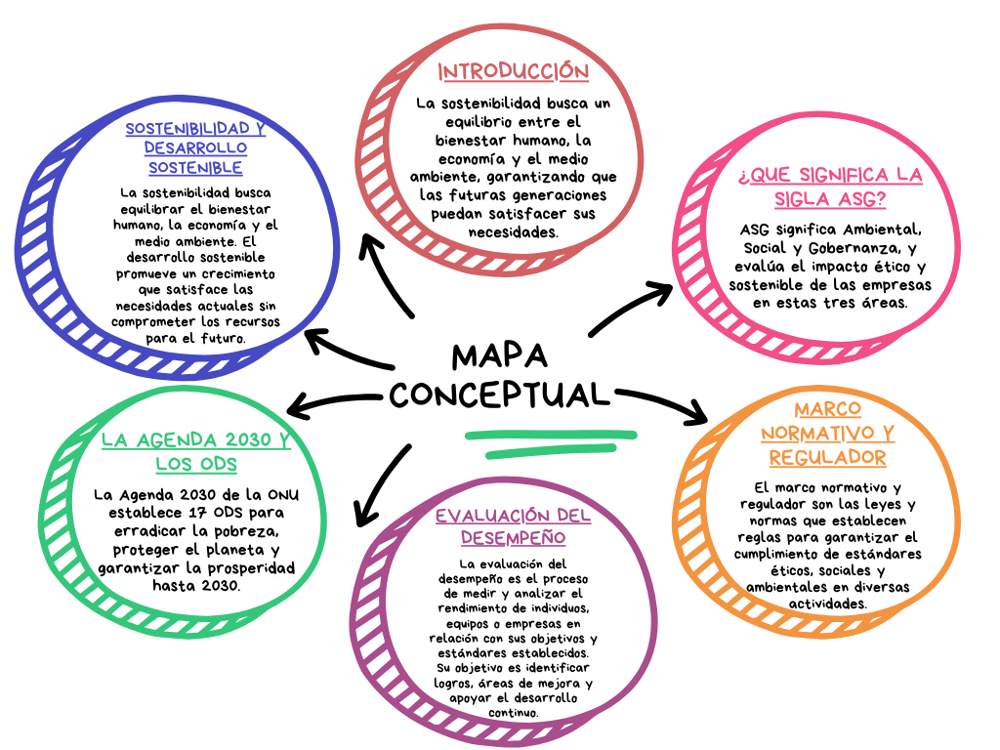

# Sostenibilidad Desarrollo Sostenible

## Índice
1.1. [Introducción](introduccion.md)

1.2 [Sostenibilidad y desarrollo sostenible](Sostenibilidad.md)

1.3 [¿Qué significa la sigla ASG?]()

1.4 [La Agenda 2030 y los ODS](agenda.md)

1.5 [Marco normativo y regulador de la sostenibilidad en Europa]()

1.6 [Evaluación del desempeño en sostenibilidad de las empresas]()

## Conclusiones
## Mapa conceptual (Herramientas utilizada)

---
Herramienta Utilizada: Canva
## Glosario (Asamblea, Biodiversidad, Derechos humanos, Gobernanza, Kioto, métrica)
## Referencias
## Autores
---
Iván Palma Sierra
Iker Cupillar Aliagar
Álvaro Moreno Dominguez
