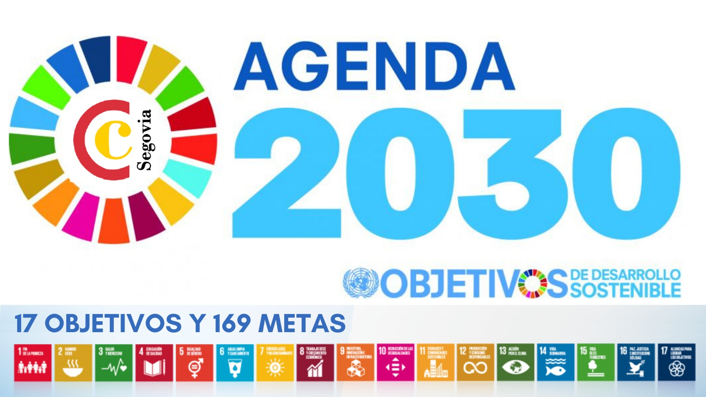

 # La Agenda 2030 y los ODS
 
La Agenda 2030 es un plan creado por la ONU en 2015 para mejorar el mundo y ayudar a las personas. Incluye 17 Objetivos de Desarrollo Sostenible (ODS), que son como metas para enfrentar problemas importantes, como la pobreza, la desigualdad y el cambio climático.

Cada ODS tiene cosas específicas que se deben lograr para que todos tengan una vida mejor. La idea es que todos, desde los gobiernos hasta las personas comunes, trabajen juntos para hacer del planeta un lugar más justo y sostenible para todos.

[Referencia](https://www.undp.org/es/sustainable-development-goals)
