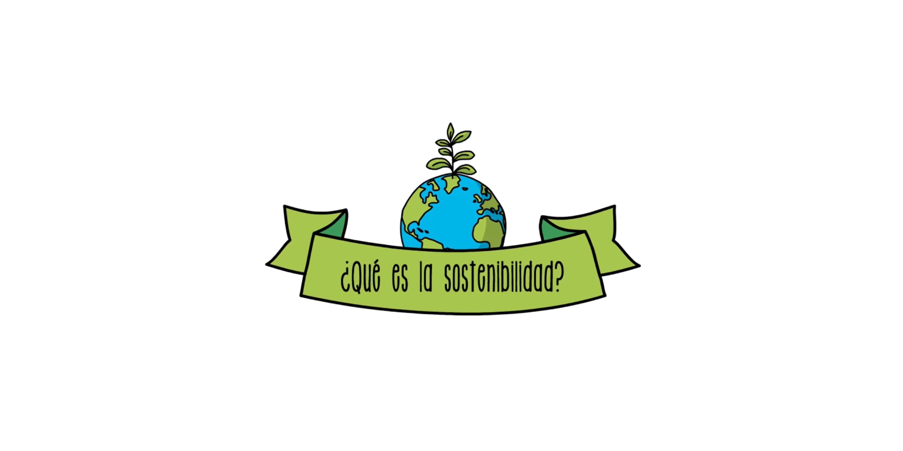

# 1.2. Sostenibilidad y desarrollo sostenible
## Ahora explicaremos lo que significa sostenibilidad y el desarrollo sostenible:

* [Sostenibilidad:](https://es.wikipedia.org/wiki/Sostenibilidad) La sostenibilidad es como encontrar una forma de vivir que no solo funcione ahora, sino que también cuide el planeta para el futuro, para entenderlo mejor, es que      vivamos bien ahora y nos cuidemos al igual que nuestro planeta, para que así el planeta y nosotros mismos estén en un buen estado para las futuras generaciones. Cómo ejemplo tenemos la energía renovable, agricultura sostenible,       reciclaje y reducción de residuos, transporte sostenible, conservación de agua, educación ambiental, construcción ecoloógica, entre muchos más!
  

* [Desarrollo sostenible:](https://es.wikipedia.org/wiki/Desarrollo_sostenible) El desarrollo sostenible es como encontrar un equilibrio entre crecer como sociedad y cuidar nuestro planeta. Imagina que quieres comprar muchas cosas, pero si lo haces sin pensar, podrías quedarte sin dinero y sin recursos. Cómo ejemplo en desarrollo sostenible tenemos la energía solar, la energía eólica, edificios verdes, transporte público eficiente, programas de reciclaje, conservación natural, de la biodiversidad y la fauna animal entre muchos más!

[Referencia](https://www.un.org/sustainabledevelopment/es/)
